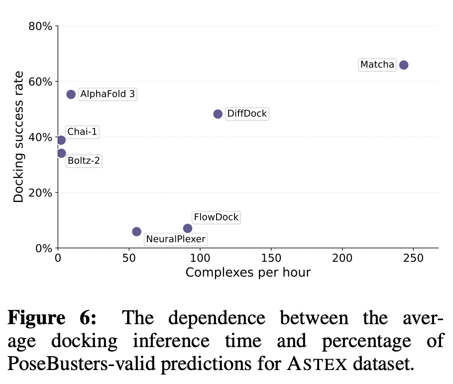

# Matcha: Multi-Stage Riemannian Flow Matching for Accurate and Physically Valid Molecular Docking

This is an official implementation of the paper [Matcha: Multi-Stage Riemannian Flow Matching for Accurate and Physically Valid Molecular Docking]().

## Overview

Matcha, is a molecular docking pipeline that combines multi-stage flow matching with learned scoring and physical validity filtering. Our approach consists of three sequential stages applied consecutively
to progressively refine docking predictions, each implemented as a flow matching model operating on appropriate geometric spaces (R^3, SO(3), and SO(2)).
We enhance the prediction quality through a dedicated scoring model and apply
unsupervised physical validity filters to eliminate unrealistic poses. 


Compared to various approaches, Matcha demonstrates superior performance on Astex
and PDBBind test sets in terms of docking success rate and physical plausibility.
Moreover, our method works approximately 25× faster than modern large-scale
co-folding models.



## Content
- [Installation](#install)
- [Datasets](#datasets)
  - [Existing datasets](#exist_datasets)
  - [Adding new dataset](#new_datasets)
- [Preparing the config file](#config)
- [Running inference with one script](#inference)
- [Running inference step-by-step](#inference_steps)
  - [Preprocessing](#preproc)
  - [Inference](#inf)
  - [Metrics computation](#metrics)
- [License](#license)


## Installation <a name="install"></a>
To install the `matcha` package, do the following:

```bash
cd matcha
pip install -e .
```

## Datasets <a name="datasets"></a>
### Existing datasets <a name="exist_datasets"></a>
If you want to make predictions for existing test datasets, you need to download them first.
Astex and PoseBusters datasets can be downloaded [here](https://zenodo.org/records/8278563).
PDBBind_processed can be found [here](https://zenodo.org/records/6408497).
DockGen can be downloaded from [here](https://zenodo.org/records/10656052).

### Adding new dataset <a name="new_datasets"></a>
If you need to predict some new data, you need to construct a dataset folder with the following structure:
```
- dataset_path
    - uid1
        - f'{uid1}_protein.pdb' - protein structure file
        - f'{uid1}_ligand.sdf' - ligand sdf file (can be an arbitrary conformation or a true position: we compute random conformers anyway)
    - uid2
        - f'{uid2}_protein.pdb'
        - f'{uid2}_ligand.sdf' 
    - ...
```
## Preparing the config file <a name="config"></a>
1. You need to provide paths to the required datasets. Edit the `configs/paths/paths.yaml` file: add `posebusters_data_dir`, `astex_data_dir`, `pdbbind_data_dir`, `dockgen_data_dir`. For a new dataset provide its path in `any_data_dir`. 

If you do not need all datasets, comment unnecessary datasets in the config's `test_dataset_types`, keeping only those that are needed.

2. Provide data paths to keep intermediate and final data:
- `cache_path`: path where intermediate dataset cache files will be stored
- `data_folder`: path where intermediate files will be stored (eg. ESM embeddings)
- `inference_results_folder`: <path_to_inference_results>

3. Download checkpoints for Matcha for [here](https://huggingface.co/LigandPro/Matcha). You need to download the `pipeline` folder. Provide the path to the folder where you store them (folder that contains `pipeline`) in the `checkpoints_folder` in paths.yaml.


## Running inference with one script <a name="inference"></a>
The script to compute all preprocessing and inference scripts in one. 
Provide `--compute_final_metrics` if your dataset has true ligand positions in f'{uid_i}_ligand.sdf', so we can compute RMSD metrics and PoseBusters filters.
Argument `-n inference_folder_name` is a name of a folder where to store inference results for dataset.

```bash
CUDA_VISIBLE_DEVICES=0 python scripts/full_inference.py -c configs/base.yaml -p configs/paths/paths.yaml -n inference_folder_name --n_samples 40 --compute_final_metrics
```

This script will provide a step-by-step computation of protein ESM embeddings, docking predictions, physically-aware unsupervised post-filtration, scoring and saving predictions to sdf.


## Running inference step-by-step <a name="inference_steps"></a>
### Preprocessing <a name="preproc"></a>
Run scripts to compute protein sequences anf ESM embeddings for all test datasets.

```bash
python scripts/prepare_esm_sequences.py -p configs/paths/paths.yaml
CUDA_VISIBLE_DEVICES=0 python scripts/compute_esm_embeddings.py -p configs/paths/paths.yaml
```

### Inference <a name="inf"></a>

To run inference:
```bash
CUDA_VISIBLE_DEVICES=0 python scripts/run_inference_pipeline.py -c configs/base.yaml -p configs/paths/paths.yaml -n inference_folder_name --n_samples 40
```

Then run `posebusters_unsupervised.py` to do fast unsupervised post-filtration and `save_preds_for_npbench.py` to get top-1 ranked pose. The top-ranked poses for each complex are stored in the `inference_results_folder/inference_folder_name/sdf_predictions`.
You need to provide the same `--n_samples`, as for the `run_inference_pipeline.py`.

```bash
CUDA_VISIBLE_DEVICES=0 python scripts/posebusters_unsupervised.py -c configs/base.yaml -p configs/paths/paths.yaml -n inference_folder_name --n_samples 40
python scripts/save_preds_for_npbench.py -p configs/paths/paths.yaml -n inference_folder_name
```

### Metrics computation <a name="metrics"></a>

Optionally, you can compute sample-level and dataset-level metrics (such as symmetry-corrected RMSD and passing PoseBusters filters) having your predictions.
Individual metrics for each sample are stored in the folder with inference results in file `f'{dataset_name}_final_preds_all_metrics.npy'`.

Dataset-level statistics are stored in the folder with inference results in file `f'{dataset_name}_final_metrics.csv'`.
This can be done with the command:

```bash
python scripts/compute_metrics.py -p configs/paths/paths.yaml -n inference_folder_name
```

## License <a name="license"></a>
Shield: [![CC BY 4.0][cc-by-shield]][cc-by]

This work is licensed under a
[Creative Commons Attribution 4.0 International License][cc-by].

[![CC BY 4.0][cc-by-image]][cc-by]

[cc-by]: http://creativecommons.org/licenses/by/4.0/
[cc-by-image]: https://i.creativecommons.org/l/by/4.0/88x31.png
[cc-by-shield]: https://img.shields.io/badge/License-CC%20BY%204.0-lightgrey.svg
