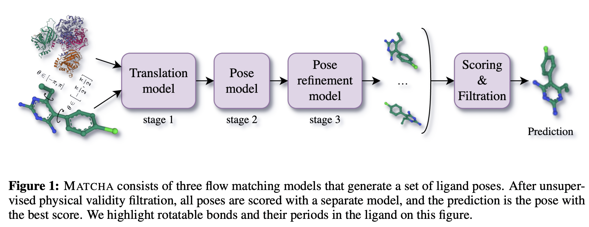
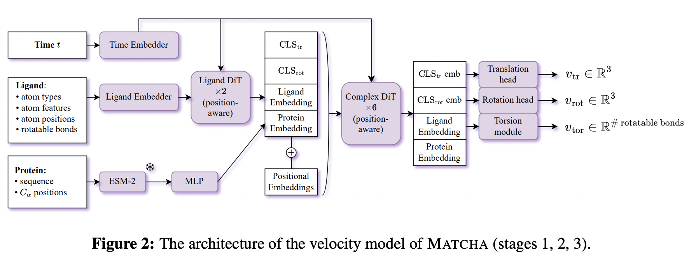

# Matcha: Multi-Stage Riemannian Flow Matching for Accurate and Physically Valid Molecular Docking

This is an official implementation of the paper [Matcha: Multi-Stage Riemannian Flow Matching for Accurate and Physically Valid Molecular Docking](https://arxiv.org/abs/2510.14586).

## News

We have updated the repository and the [Hugging Face checkpoints](https://huggingface.co/LigandPro/Matcha): the current code and weights correspond to the improved pipeline and **much better results**! The previous version, however, remains available as tag `v1` (`git checkout v1`).

## Overview

Matcha is a molecular docking pipeline that combines multi-stage flow matching with learned scoring and physical validity filtering. Our approach consists of three sequential stages applied consecutively to progressively refine docking predictions, each implemented as a flow matching model operating on appropriate geometric spaces (R³, SO(3), and SO(2)). We enhance the prediction quality through a dedicated scoring model and apply unsupervised physical validity filters to eliminate unrealistic poses.




Compared to various approaches, Matcha demonstrates superior performance on Astex and PDBBind test sets in terms of docking success rate and physical plausibility. Moreover, our method works approximately 31× faster than modern large-scale co-folding models.


## Content

- [Installation](#install)
<!-- - [CLI usage](#cli) -->
- [Datasets](#datasets)
  - [Existing datasets](#exist_datasets)
  - [Adding new dataset](#new_datasets)
- [Preparing the config file](#config)
- [Protein preprocessing (for GNINA)](#protein_preprocessing)
- [Running inference step-by-step](#inference_steps)
  - [Preprocessing](#preproc)
  - [Matcha inference](#inf)
  - [Pose selection and filtration](#gnina)
- [Benchmarking and pocket-aligned RMSD computation](#benchmarking)
- [License](#license)
- [Citation](#citation)

## Installation <a name="install"></a>

```bash
# Install with uv
uv sync
```

Or with pip:

```bash
pip install -e .
```

<!-- ## CLI usage <a name="cli"></a>

The recommended way to run inference is via scripts (`full_inference.py`, `final_inference_pipeline.sh`). The `matcha` CLI is kept for compatibility but delegates to the same pipeline; for single-run inference use the scripts below.

Run single ligand:

```
uv run matcha -r protein.pdb -l ligand.sdf -o results/ --gpu 0 [--run-name name]
```

Run batch (multi-ligand file or directory):

```
uv run matcha -r protein.pdb --ligand-dir ligands.sdf -o results/ --run-name batch --gpu 0
```

Search space options: manual box (`--center-x/--center-y/--center-z`), autobox (`--autobox-ligand ref.sdf`), or blind docking if none provided. -->

## Datasets <a name="datasets"></a>

### Existing datasets <a name="exist_datasets"></a>

Astex and PoseBusters datasets can be downloaded [here](https://zenodo.org/records/8278563). PDBBind_processed can be found [here](https://zenodo.org/records/6408497). DockGen can be downloaded from [here](https://zenodo.org/records/10656052).

### Adding new dataset <a name="new_datasets"></a>

Use a dataset folder with the following structure:

```
dataset_path/
    uid1/
        uid1_protein.pdb
        uid1_ligand.sdf
    uid2/
        uid2_protein.pdb
        uid2_ligand.sdf
    ...
```

## Preparing the config file <a name="config"></a>

1. Edit `configs/paths/paths.yaml`: set `posebusters_data_dir`, `astex_data_dir`, `pdbbind_data_dir`, `dockgen_data_dir` (or `any_data_dir` for a new dataset). Comment out unneeded entries in `test_dataset_types`.

2. Set paths for intermediate and final data:
   - `cache_path`, `data_folder`, `inference_results_folder`
   - `preprocessed_receptors_base`: root directory for **preprocessed** protein structures used by the GNINA affinity scripts (see [Protein preprocessing](#protein_preprocessing)). Required when using GNINA steps; layout: `{preprocessed_receptors_base}/{dataset}_{uid}/{dataset}_{uid}_protein.pdb`.

3. Download checkpoints from [Hugging Face (LigandPro/Matcha)](https://huggingface.co/LigandPro/Matcha) (the `matcha_pipeline` folder). Set `checkpoints_folder` in paths.yaml to the folder that contains it.

## Protein preprocessing (for GNINA) <a name="protein_preprocessing"></a>

Protein structures used by the GNINA affinity scripts must be preprocessed (hydrogenation, PDBQT, etc.). We use the [dockprep-pipeline](https://github.com/LigandPro/dockprep-pipeline) for receptor and ligand preparation; see that repository for a minimal pipeline (Reduce/OpenMM hydrogenation, Meeko PDBQT). Further details are in the paper.

## Running inference step-by-step <a name="inference_steps"></a>

### Preprocessing <a name="preproc"></a>

```bash
uv run python scripts/prepare_esm_sequences.py -p configs/paths/paths.yaml
CUDA_VISIBLE_DEVICES=0 uv run python scripts/compute_esm_embeddings.py -p configs/paths/paths.yaml
```

### Matcha inference <a name="inf"></a>

```bash
CUDA_VISIBLE_DEVICES=<gpu_device_id> uv run python scripts/run_inference_pipeline.py -c configs/base.yaml -p configs/paths/paths.yaml -n inference_folder_name --n-samples 20
```

### Pose selection and filtration <a name="gnina"></a>

To run the full pipeline including GNINA affinity, minimization, top-pose selection, and metrics:

```bash
uv run bash scripts/final_inference_pipeline.sh -n inference_folder_name -c configs/base.yaml -p configs/paths/paths.yaml -d <gpu_device_id> -s 20 -g </path/to/gnina_executable> [--compute_final_metrics]
```

You must set `preprocessed_receptors_base` in paths.yaml (or provide preprocessed structures as required by the GNINA scripts) and pass `-g` with the path to your GNINA runner script.
If you pass `--compute_final_metrics`, the script will compute dataset-level metrics for top-1 pose for each complex. 
Metrics include the computation of symmetry-corrected RMSD and PoseBusters filters.

## Benchmarking and pocket-aligned RMSD computation <a name="benchmarking"></a>

For other docking methods, prepare a folder of predictions with the structure described in the script. Then:

```bash
uv run python scripts/compute_aligned_rmsd.py -p configs/paths/paths.yaml -a base --init-preds-path <path_to_initial_preds>
```

Set `methods_data` and `dataset_names` inside the script as needed.
For each method in `methods_data`, set flag `has_predicted_proteins` that indicates that the protein pdb itself has coordinates that differ from the original holo structure.
Choose between `base` and `pocket` alignment (see Appendix G in the paper). 
By default we use `pocket` alignment for methods that have predicted protein structures (eg. AlphaFold3), and `base` for rigid docking methods (eg. DiffDock). In the latter case for rigid docking the alignment is not performed, but the results are rearranged for the further metrics computation.
The resulting structures will appear in the `inference_results_folder/<baseline_method_name>_<pocket_alignment_type>`.

After aligning the predicted structures to the original holo protein structure, metrics from the best SDF predictions can be computed with:

```bash
uv run python scripts/compute_metrics_from_sdf.py -p configs/paths/paths.yaml -n <baseline_method_name>_<pocket_alignment_type> --prediction-type best_base_predictions
```

## License <a name="license"></a>

This work is licensed under a [Creative Commons Attribution-NonCommercial 4.0 International License](https://creativecommons.org/licenses/by-nc/4.0/).

[](https://creativecommons.org/licenses/by-nc/4.0/)

## Citation <a name="citation"></a>

If you use Matcha in your work, please cite:

```bibtex
@misc{frolova2025matchamultistageriemannianflow,
      title={Matcha: Multi-Stage Riemannian Flow Matching for Accurate and Physically Valid Molecular Docking}, 
      author={Daria Frolova and Talgat Daulbaev and Egor Sevriugov and Sergei A. Nikolenko and Dmitry N. Ivankov and Ivan Oseledets and Marina A. Pak},
      year={2025},
      eprint={2510.14586},
      archivePrefix={arXiv},
      primaryClass={cs.LG},
      url={https://arxiv.org/abs/2510.14586}, 
}
```
